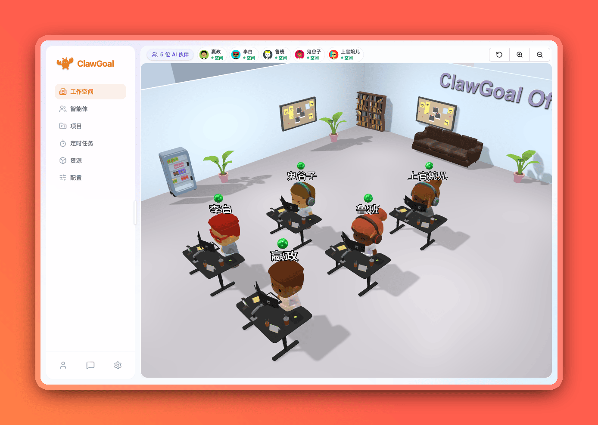
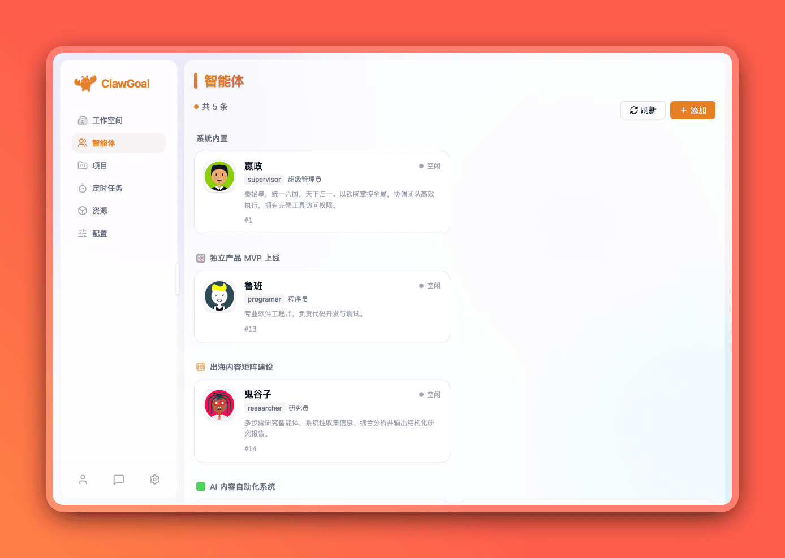
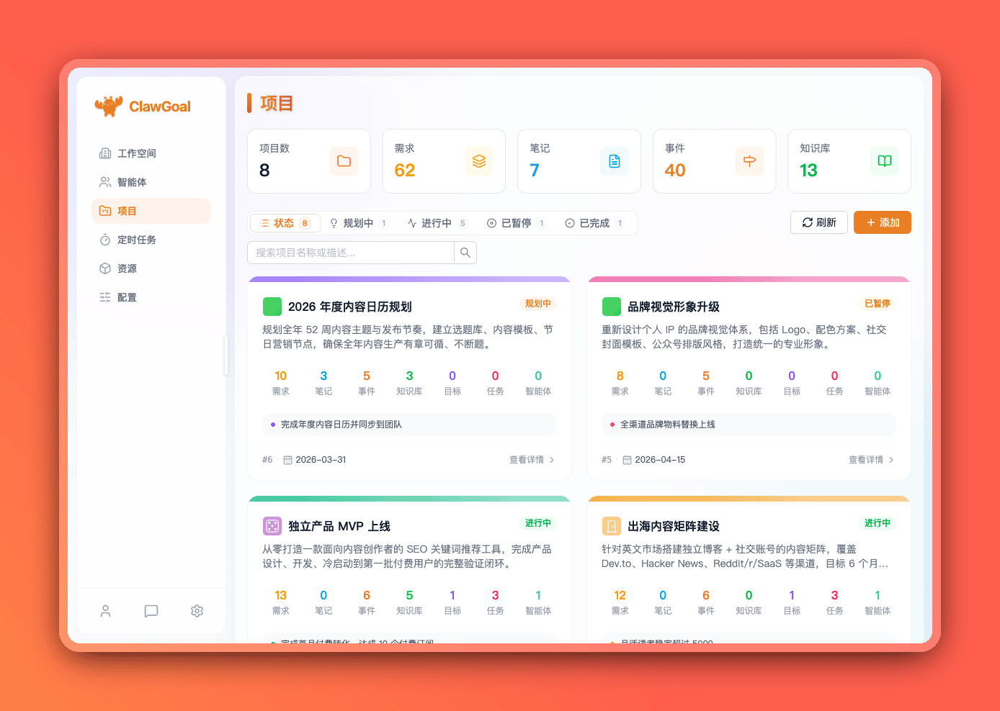
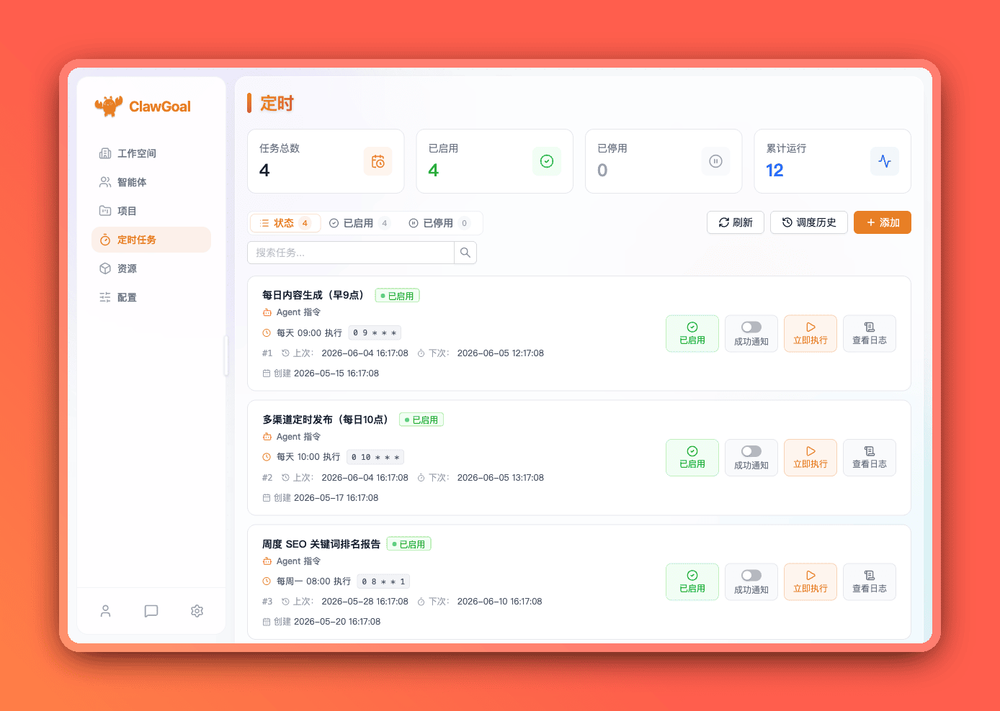
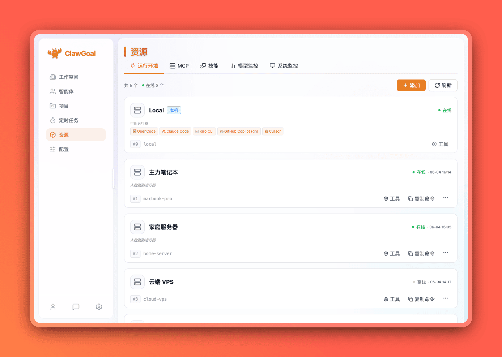
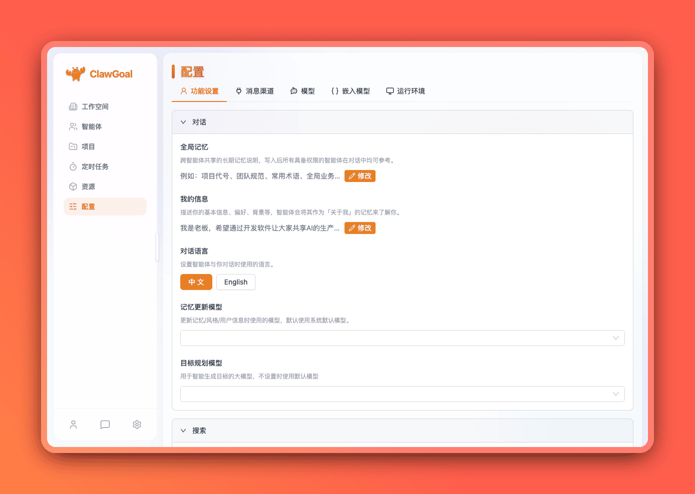
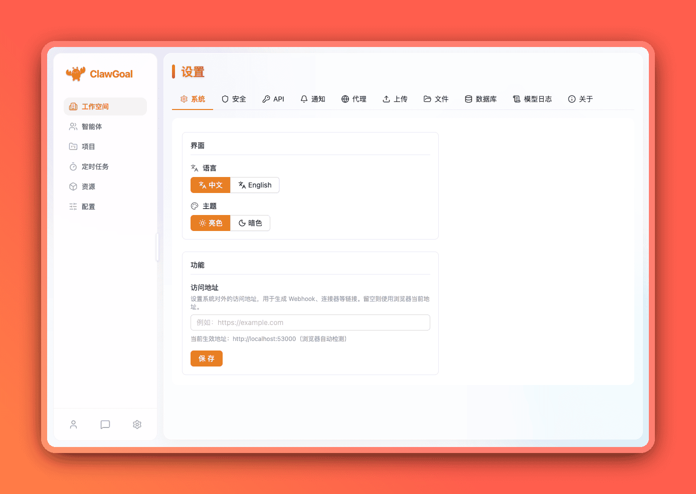

# ClawGoal

[简体中文](README.md) | [English](README.en-US.md)

> 基于目标与 OKR 的 AI Agent 工作台，让 AI 围绕清晰目标、有序计划和可追踪任务持续推进。🚀

ClawGoal 以 OKR 为核心，把目标、项目、任务、知识库、自动化和多智能体协作串成一条执行链路，让 AI 从“临时问答”变成“围绕目标持续推进”。

## 🖼️ 界面预览



<table width="100%">
  <thead>
    <tr>
      <th width="50%">智能体</th>
      <th width="50%">项目 / OKR</th>
    </tr>
  </thead>
  <tbody>
    <tr>
      <td></td>
      <td></td>
    </tr>
  </tbody>
</table>

<table width="100%">
  <thead>
    <tr>
      <th width="50%">定时任务</th>
      <th width="50%">资源管理</th>
    </tr>
  </thead>
  <tbody>
    <tr>
      <td></td>
      <td></td>
    </tr>
  </tbody>
</table>

<table width="100%">
  <thead>
    <tr>
      <th width="50%">功能配置</th>
      <th width="50%">系统设置</th>
    </tr>
  </thead>
  <tbody>
    <tr>
      <td></td>
      <td></td>
    </tr>
  </tbody>
</table>

## 🎯 为什么是 OKR 驱动？

AI 如果缺少目标约束，很容易变成零散对话。ClawGoal 用 `Objective → Key Results → Project → Task → Agent` 的链路组织工作，让目标、执行、记录和复盘保持一致。

## ✨ 功能亮点

### 🎯 OKR、项目与任务闭环

- 管理 Objective、Key Results、项目、任务树和 Backlog。
- 将事件、笔记、Wiki、指标统一关联到项目。
- 用指标图表和执行记录追踪 OKR 推进效果。

### 🤖 围绕目标工作的智能体

- 管理多个 Agent，支持内置角色、自定义角色和项目绑定。
- 记录会话、日志、工具调用、工作流消息和长期记忆。
- 支持变更审核、Diff 查看、通过或拒绝 Agent 输出。

### 🧠 知识库、笔记与记忆

- 管理 Wiki、笔记、项目资料和同步历史。
- 支持网页或 Markdown 知识同步。
- 支持 Agent 记忆与语义检索。

### ⏱️ 定时任务与自动化

- 创建 Cron 定时任务，支持启停、手动触发、历史和日志。
- 可触发 Agent、Shell 或 Runtime 任务。
- 支持模型自动总结执行结果。

### 🔌 资源、运行时与 MCP

- 管理本地和远程运行时。
- 连接 Codex、Claude Code、OpenCode、ACP 等外部执行环境。
- 配置 MCP Server 和 Skill，扩展 Agent 可用工具。

### 💬 消息渠道与 Webhook

- 支持 Telegram、Slack、Discord、飞书、钉钉、企业微信等渠道。
- 支持 Webhook 接入外部消息。
- 支持渠道启停、健康状态和归属配置。

### 📊 指标、事件与分享

- 维护项目指标、数据点、图表和汇总。
- 记录项目事件，支持笔记和事件公开分享。
- 提供 3D Office 工作空间入口。

## 🧭 两种运行模式

| 模式 | 适合场景 | 数据位置 |
| --- | --- | --- |
| 浏览器模式 | 部署到服务器、NAS、内网主机或云主机，通过浏览器访问 | 服务端数据目录 |
| 桌面模式 | 个人离线使用，直接打开桌面 App | 本机数据目录 |

## 🚀 快速开始

### 方式一：浏览器模式

下载当前系统对应的 **ClawGoal Server 二进制发布包**，解压后运行：

```bash
./clawgoal serve
```

Windows 用户可以在 PowerShell 中运行：

```powershell
.\clawgoal.exe serve
```

启动成功后，通过浏览器访问：

```text
http://localhost:53001
```

### 方式二：桌面模式

下载当前系统对应的 **ClawGoal 桌面 App 安装包**，安装后直接打开应用。

桌面模式会在本机启动内置服务，所有数据默认保存在本机数据目录中。

## 🔧 配置说明

配置示例位于：

```text
packages/backend/src/config/config.example.yaml
```

运行时默认会从 `~/.clawgoal/data/config.yaml` 读取配置，也可以通过 `DATA_PATH` 环境变量覆盖数据目录。

核心配置包括：

- `port`：后端 HTTP 服务端口。
- `timezone`：Cron 调度和模型时间注入使用的 UTC 偏移。
- `lang`：默认语言，支持 `en-US` 与 `zh-CN`。
- `database`：目前仅支持 `sqlite`。
- `auth` / `jwt`：登录方式、默认用户和 JWT Secret。
- `upload`：上传存储后端与文件限制。
- `proxy`：模型调用代理。
- `modelProviders`：模型供应商与模型列表。
- `embeddingModel`：知识记忆和语义检索使用的 embedding 后端。
- `model`：逻辑模型别名与 fallback 链。
- `agent`：Agent 并发数与任务数据目录。
- `claw.skillDirs`：追加自定义技能目录。

> ⚠️ 生产环境请务必修改默认账号、密码、JWT Secret、模型 API Key 和上传配置。

## 📚 使用文档

### 安装说明

ClawGoal 支持两种安装方式：

- **浏览器模式**：下载 Server 二进制程序，部署后通过浏览器访问。
- **桌面模式**：下载桌面 App 安装包，安装后直接打开使用。

安装前建议准备：

- 当前系统对应的 ClawGoal 发布包
- 一个安全的登录密码
- 一个用于保存数据的目录
- 可用的 AI 模型 API Key

### 浏览器模式安装

浏览器模式适合部署在服务器、NAS、内网主机或云主机上。

1. 下载当前系统对应的 **ClawGoal Server 二进制发布包**。
2. 解压到固定目录。
3. 首次运行 `clawgoal`，按提示设置数据目录、端口、账号和密码。
4. 启动服务：

```bash
./clawgoal serve
```

Windows 用户运行：

```powershell
.\clawgoal.exe serve
```

启动后访问：

```text
http://localhost:53001
```

服务器部署时，请放行端口或配置反向代理。

### 桌面模式安装

桌面模式适合个人本地离线使用。

1. 下载当前系统对应的 **ClawGoal 桌面 App 安装包**。
2. 按系统提示完成安装。
3. 首次打开 App，按提示选择数据目录并创建账号。
4. 登录后进入功能配置，填写模型 API Key。

桌面模式会在本机启动内置服务，数据默认保存在本机数据目录中。

### 常见问题

**浏览器打不开怎么办？**

请检查服务是否启动、端口是否被占用、防火墙或安全组是否放行端口。

**桌面 App 打不开怎么办？**

请检查系统安全策略、杀毒软件拦截、执行权限和数据目录写入权限。

**Agent 不回复怎么办？**

请检查模型 API Key、API Base、模型名称、网络连接和模型服务余额。

**数据需要备份什么？**

建议备份整个数据目录，包括 `config.yaml`、SQLite 数据库、上传文件、日志和 Agent 任务数据。

## 🤝 参与贡献

欢迎提交 Issue、功能建议和 Pull Request。建议在贡献前先执行：

```bash
pnpm install
pnpm check
pnpm build
```

如果新增业务能力，请尽量同步补充中英文文案、配置示例和必要的接口说明。

## 加入交流群

> 添加时请备注 ClawGoal

<table width="100%">
  <thead>
    <tr>
      <th width="50%">微信交流群</th>
      <th width="50%">QQ 交流群</th>
    </tr>
  </thead>
  <tbody>
    <tr>
      <td>
        
      </td>
      <td>
        
      </td>
    </tr>
  </tbody>
</table>

## 📄 License

本项目基于 Apache License 2.0 开源协议发布，详见 [LICENSE](/Users/mz/data/project/clawgoal/clawgoal-pro/LICENSE)。
